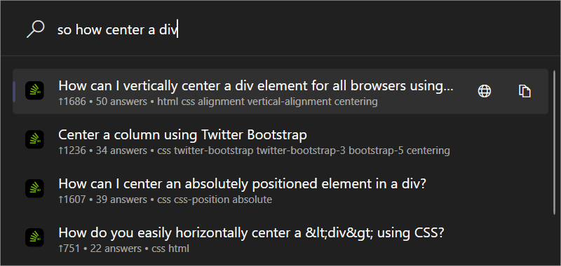
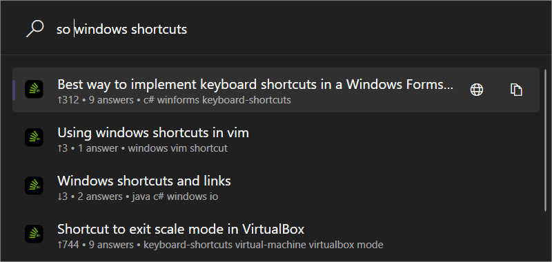

<div align="center">

# 📚 StackOverflow for PowerToys Run


### *Instant Access to Millions of Programming Solutions for true old school developers :beer*

**Stop alt-tabbing to your browser for every coding question.**  
Search StackOverflow directly from PowerToys Run → `Alt+Space` → `so python async` → Done! ✨

[](https://github.com/ruslanlap/PowerToysRun-StackOverflow/releases/latest)
[](https://github.com/ruslanlap/PowerToysRun-StackOverflow/releases/latest)
[](https://github.com/ruslanlap/PowerToysRun-StackOverflow/stargazers)
[](https://github.com/hlaueriksson/awesome-powertoys-run-plugins)

</div>

---

## 🎯 Why Developers Love It

<div align="center">

**"Stop context-switching to find that solution you saw yesterday"**

| ❌ Before | ✅ With StackOverflow Plugin |
|-----------|-------------------|
| Open browser → Google → StackOverflow → Scroll → Click | `Alt+Space` → `so react hooks` → Enter |
| 30+ seconds, lost focus | **2 seconds, zero interruption** |

</div>

### 🚀 **Quick Demo** - Try it now

```
Alt+Space → so python async await           # 🐍 Python questions
Alt+Space → so javascript promises          # 💛 JavaScript help  
Alt+Space → so git merge conflict          # 🌿 Git issues
Alt+Space → so sql join types              # 🗄️ Database queries
```

<div align="center">

### 📸 See It in Action



*Search results showing vote counts, answer counts, accepted answers, and tags*



*Live search with rich metadata and instant results*

---
  
  **⬇️ Ready to boost your productivity?**
  
  <a href="https://github.com/ruslanlap/PowerToysRun-StackOverflow/releases/download/v1.0.0/StackOverflow-1.0.0-x64.zip">
    
  </a>
  <a href="https://github.com/ruslanlap/PowerToysRun-StackOverflow/releases/download/v1.0.0/StackOverflow-1.0.0-ARM64.zip">
    
  </a>
</div>

## 🧭 Table of Contents

- [Overview](#-overview)
- [Features](#-features)
- [Installation](#-installation)
- [Quick Start](#️-get-started-in-60-seconds)
- [Usage Examples](#-power-user-tips)
- [API Key Setup (Optional)](#-api-key-setup-optional)
- [For Developers](#️-for-developers)
- [FAQ](#-faq)
- [Troubleshooting](#-troubleshooting)
- [Security & Privacy](#-privacy--security)
- [Contributing](#-community--support)
- [License](#-license)
- [Acknowledgements](#-acknowledgements)

## 📝 Overview

**StackOverflow Plugin** brings the world's largest programming Q&A platform directly into PowerToys Run. Search millions of StackOverflow questions without leaving your IDE or terminal. Get instant answers with smart caching, vote counts, accepted answers, and tags—all from `Alt+Space` → `so your question`.

- **Plugin ID:** `FFCA3E1DBB5247549B71A712AF2F03EC`
- **Action Keyword:** `so` (customizable)
- **Platform:** Windows 10/11 (x64, ARM64)
- **Tech:** C#/.NET 9.0, Stack Exchange API v2.3+
- **Rate Limit:** 300/day (anonymous) or 10,000/day (with API key)

---

## ⚡ Features That Matter

<div align="center">
<table>
<tr>
<td align="center" width="33%">

<br><b>🔍 Instant Search</b><br>
<sub>Search StackOverflow without<br>opening your browser</sub>
</td>
<td align="center" width="33%">

<br><b>📊 Rich Metadata</b><br>
<sub>Votes, answers, tags, and<br>accepted answer indicators</sub>
</td>
<td align="center" width="33%">

<br><b>⚡ Lightning Fast</b><br>
<sub>Smart caching with<br>sub-second responses</sub>
</td>
</tr>
<tr>
<td align="center" width="33%">

<br><b>🔗 One-Click Open</b><br>
<sub>Press Enter to open in<br>default browser</sub>
</td>
<td align="center" width="33%">

<br><b>💾 Smart Cache</b><br>
<sub>1-hour TTL, 50 queries max<br>LRU eviction</sub>
</td>
<td align="center" width="33%">

<br><b>🔒 Optional API Key</b><br>
<sub>Encrypted storage for<br>10,000 requests/day</sub>
</td>
</tr>
</table>
</div>

---

## 📥 Installation

### Requirements

- **Operating System**: Windows 10/11 (version 10.0.22621.0 or higher)
- **PowerToys**: Version 0.93.0 or higher
- **Architecture**: x64 or ARM64
- **Internet**: Required for searching (cache works offline)

### Installation Steps

1. **Download the plugin**
   - Visit the [latest release](https://github.com/ruslanlap/PowerToysRun-StackOverflow/releases/latest)
   - Download the appropriate ZIP file for your system:
     - `StackOverflow-1.0.0-x64.zip` for 64-bit Windows
     - `StackOverflow-1.0.0-ARM64.zip` for ARM64 Windows

2. **Extract to PowerToys plugins directory**

   Navigate to:

   ```
   %LOCALAPPDATA%\Microsoft\PowerToys\PowerToys Run\Plugins\
   ```

   Full path example:

   ```
   C:\Users\YourName\AppData\Local\Microsoft\PowerToys\PowerToys Run\Plugins\
   ```

   Extract the downloaded ZIP file here. You should have:

   ```
   Plugins\StackOverflow\plugin.json
   Plugins\StackOverflow\Community.PowerToys.Run.Plugin.StackOverflow.dll
   Plugins\StackOverflow\Images\...
   ```

3. **Restart PowerToys**
   - Right-click the PowerToys icon in your system tray
   - Select **"Exit PowerToys"**
   - Launch PowerToys again from the Start Menu

4. **Verify installation**
   - Press `Alt+Space` to open PowerToys Run
   - Type `so test` and press Enter
   - You should see the plugin prompt for StackOverflow search

### Uninstallation

To remove the plugin:

1. Navigate to `%LOCALAPPDATA%\Microsoft\PowerToys\PowerToys Run\Plugins\`
2. Delete the `StackOverflow` folder
3. Restart PowerToys

---

## 🏃‍♂️ Get Started in 60 Seconds

### 1️⃣ **Download** (15 seconds)

Choose your architecture from [Latest Releases](https://github.com/ruslanlap/PowerToysRun-StackOverflow/releases/latest):

- `StackOverflow-1.0.0-x64.zip` (6.4 MB)
- `StackOverflow-1.0.0-ARM64.zip` (6.4 MB)

### 2️⃣ **Extract to Plugin Directory** (30 seconds)

```
%LOCALAPPDATA%\Microsoft\PowerToys\PowerToys Run\Plugins\StackOverflow
```

Example:

```
C:\Users\YourName\AppData\Local\Microsoft\PowerToys\PowerToys Run\Plugins\StackOverflow\
```

### 3️⃣ **Restart PowerToys** (15 seconds)

Right-click PowerToys tray icon → Exit → Restart from Start Menu

### 4️⃣ **Test Drive** 🎯

Hit `Alt+Space` → Type `so python async` → See instant results! ✨

> **Pro Tip:** Get an API key for 10,000 requests/day instead of 300! See [API Key Setup](#-api-key-setup-optional)

---

## 💡 Power User Tips

<div align="left">

```bash
# 🐛 Error Lookups
so TypeError: NoneType object is not subscriptable
so CORS error javascript
so NullPointerException java

# 🎯 Language-Specific Questions
so python async await              # Python questions
so javascript promises vs async    # JavaScript comparisons
so c# linq query syntax           # C# questions
so sql window functions           # Database queries

# 🔧 Framework & Tool Help
so react hooks explained
so docker compose networking
so git merge vs rebase
so kubernetes deployment yaml

# 📚 Best Practices & Patterns
so dependency injection best practices
so microservices design patterns
so clean code principles
```

</div>

### What Makes a Good Query?

✅ **Good queries**:

```
so python list comprehension syntax
so react useState update object  
so sql group by having clause
```

❌ **Avoid**:

```
so help              # Too vague
so a                 # Too short (min 2 chars)
so [very long text exceeding 200 characters...]  # Too long
```

---

## 🔑 API Key Setup (Optional)

Increase your rate limit from **300 to 10,000 requests/day** with a free API key.

### Quick Setup (5 minutes)

1. **Register**: Go to <https://stackapps.com/apps/oauth/register>
2. **Fill form**: App name = "PowerToys StackOverflow", leave rest default
3. **Get Key**: Copy the **Key** field (not Client Secret)
4. **Open PowerToys Settings**:
   - Right-click PowerToys tray icon → **Settings**
   - Navigate to: **PowerToys Run** → **Plugins** → **StackOverflow**
5. **Paste Your Key**: Enter it in the textbox labeled **"Stack Exchange API Key (Optional)"**
6. **Done!**: Key is saved automatically, no restart needed

**Security**: Your API key is stored securely by PowerToys!

📖 **Full Guide**: See [API_KEY_SETUP.md](API_KEY_SETUP.md) for detailed instructions

---

## 🏗️ For Developers

### 🚀 **Quick Build**

```bash
git clone https://github.com/ruslanlap/PowerToysRun-StackOverflow.git
cd PowerToysRun-StackOverflow
./build-and-zip.sh  # Creates distribution-ready packages for x64 and ARM64
```

### 🧪 **Tech Stack**

- **Runtime**: .NET 9.0 targeting Windows 10.0.22621.0+
- **API**: Stack Exchange API v2.3+ with gzip compression
- **Caching**: In-memory LRU cache with 1-hour TTL
- **Storage**: Windows DPAPI for encrypted API key storage
- **Architecture**: Service-oriented with Models/Services/Formatters separation

### 🎯 **Project Highlights**  

- **TDD Development**: Comprehensive unit test coverage
- **Clean Architecture**: Well-separated concerns, easily testable
- **Multi-Platform**: x64 + ARM64 builds
- **CI/CD Ready**: GitHub Actions automation
- **Performance**: <100MB memory, sub-second cached responses

### 📁 **Project Structure**

```
StackOverflow/
├── Models/              # Domain models (StackOverflowQuestion, SearchQuery, etc.)
├── Services/            # API client, caching, settings management
├── Formatters/          # Result presentation logic
└── Main.cs             # Plugin entry point
```

<div align="left">

**Want to contribute?**

[](CONTRIBUTING.md)
[](https://github.com/ruslanlap/PowerToysRun-StackOverflow/issues)

</div>

---

## 🌟 Community & Support

<div align="left">

### Show Some Love ❤️

If this plugin saves you time, consider starring the repo and sharing with fellow developers!

[](https://github.com/ruslanlap/PowerToysRun-StackOverflow/stargazers)
[](https://twitter.com/intent/tweet?text=Just%20found%20this%20amazing%20PowerToys%20Run%20plugin%20for%20StackOverflow!%20🚀&url=https://github.com/ruslanlap/PowerToysRun-StackOverflow)

### Support Development ☕

[](https://ruslanlap.github.io/ruslanlap_buymeacoffe/)

### Join the Community

- 🐛 [Report bugs](https://github.com/ruslanlap/PowerToysRun-StackOverflow/issues)
- 💡 [Request features](https://github.com/ruslanlap/PowerToysRun-StackOverflow/issues)  
- 🤝 [Contribute](CONTRIBUTING.md)
- 📢 [Awesome PowerToys Plugins](https://github.com/hlaueriksson/awesome-powertoys-run-plugins)

</div>

---

## 🆘 Troubleshooting

<details>
<summary><b>Plugin not showing up?</b></summary>

- ✅ **Check path**: `%LOCALAPPDATA%\Microsoft\PowerToys\PowerToys Run\Plugins\StackOverflow`  
- ✅ **Verify files**: Ensure `plugin.json` and DLL files exist in the folder
- ✅ **Restart**: Completely exit and restart PowerToys (not just minimize)
- ✅ **Windows version**: Requires Windows 10.0.22621.0 or higher
- ✅ **Enable plugin**: PowerToys Settings → PowerToys Run → Plugins → StackOverflow (enabled)

</details>

<details>
<summary><b>No search results?</b></summary>

- ✅ **Internet**: Check connection (required for API calls)
- ✅ **Query length**: Ensure query is 2-200 characters
- ✅ **Rate limit**: You may have hit 300 requests/day limit (get an API key!)
- ✅ **Keyword**: Ensure you're using `so` prefix (or your custom keyword)
- ✅ **Wait**: First search takes 2-3 seconds for API response

</details>

<details>
<summary><b>Rate limit errors (TooManyRequests)?</b></summary>

- ✅ **Get API key**: Follow [API Key Setup](#-api-key-setup-optional) for 10,000/day limit
- ✅ **Wait**: Anonymous limit resets at midnight UTC
- ✅ **Use cache**: Repeated searches use cached results (instant)

</details>

<details>
<summary><b>API key not working?</b></summary>

- ✅ **Verify key**: Check you copied the **Key** field, not Client Secret
- ✅ **Check JSON**: Ensure `settings.json` is valid JSON (use a validator)
- ✅ **Restart**: Exit and restart PowerToys completely
- ✅ **Path**: Ensure `settings.json` is in correct folder
- ✅ **Encryption**: Key should auto-encrypt after first use

</details>

<details>
<summary><b>Slow performance?</b></summary>

- ✅ **First search**: Takes 2-3 seconds (API call) - this is normal
- ✅ **Cached**: Repeated searches are <1 second
- ✅ **Network**: Check your internet connection speed
- ✅ **Memory**: Plugin uses <100MB, check if PowerToys has enough memory

</details>

---

## ❓ FAQ

<details>
<summary><b>Do I need an API key?</b></summary>
No, but recommended! Without a key you get 300 requests/day. With a free API key, you get 10,000/day.
</details>

<details>
<summary><b>Is my API key safe?</b></summary>
Yes! API keys are automatically encrypted using Windows DPAPI and stored locally. Only your Windows user can decrypt them.
</details>

<details>
<summary><b>Can I use it offline?</b></summary>
Partially. Cached results work offline (50 queries max, 1-hour cache). New searches require internet connection.
</details>

<details>
<summary><b>How do I change the trigger keyword?</b></summary>
PowerToys Settings → PowerToys Run → Plugins → StackOverflow → Change "so" to your preference (e.g., "stack", "s")
</details>

<details>
<summary><b>Why are results slow the first time?</b></summary>
First searches require API calls (2-3 seconds). Subsequent identical searches use cache (<1 second). This is normal behavior.
</details>

<details>
<summary><b>What gets cached?</b></summary>
Up to 50 most recent unique queries are cached for 1 hour. Oldest queries are evicted (LRU policy) when cache is full.
</details>

<details>
<summary><b>Can I copy links to results?</b></summary>
Yes! Right-click any result (or use context menu shortcuts) and select "Copy link" - or just press Ctrl+C.
</details>

<details>
<summary><b>Does it support other Stack Exchange sites?</b></summary>
Currently only StackOverflow. Support for SuperUser, ServerFault, AskUbuntu, etc. is planned for v1.2.0.
</details>

---

## 🔒 Privacy & Security

- ✅ **100% Local**: All data stored on your machine
- ✅ **No Tracking**: Zero analytics or telemetry
- ✅ **Open Source**: Full code transparency
- ✅ **Encrypted Storage**: API keys encrypted with Windows DPAPI
- ✅ **Secure API**: Read-only access to public StackOverflow data
- ✅ **MIT License**: Free for any use

**Your data stays yours.** Cache is in-memory only, API keys encrypted locally, no data sent to third parties.

---

## 📄 License

Released under the [MIT License](LICENSE). Free for personal and commercial use.

---

## 🙏 Acknowledgements

**Powered by amazing open-source projects:**

- [Microsoft PowerToys](https://github.com/microsoft/PowerToys) - The extensible Windows productivity toolkit
- [Stack Exchange API](https://api.stackexchange.com/) - Access to millions of programming Q&A
- [.NET](https://dotnet.microsoft.com/) - Cross-platform framework for building apps

**Special thanks to:**

- The StackOverflow community for their invaluable knowledge sharing
- PowerToys team for the amazing plugin architecture
- All contributors and users who help improve this plugin

---

<div align="center">

### 🚀 **Ready to supercharge your StackOverflow workflow?**

<a href="https://github.com/ruslanlap/PowerToysRun-StackOverflow/releases/latest">

</a>

---

**See also:** [📖 Quick Start Guide](QUICK_START.md) • [🔑 API Key Setup](API_KEY_SETUP.md) • [📝 Changelog](CHANGELOG.md)

<sub>Made with ❤️ by <a href="https://github.com/ruslanlap">@ruslanlap</a></sub>

</div>
